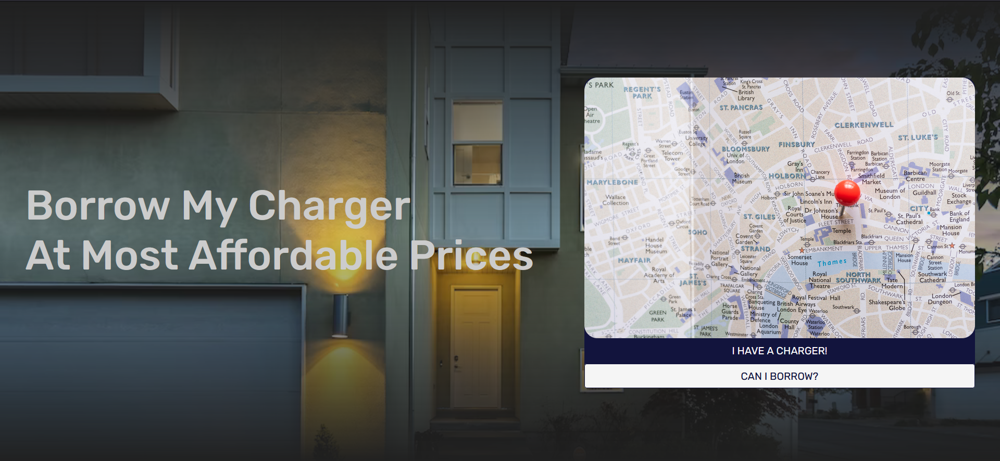

# Borrow My Charger App

Borrow My Charger is a web application that allows users to list and rent out chargers registered by other users. It provides complete global search functionality, login authentication, and dynamic loading of chargers from a MySQL database.

# Features

**User Registration and Authentication:** Users can create accounts and log in securely to the app. Passwords are stored securely.
**Charger Listing:** Users can register their chargers in the app by providing details such as charger type, availability, location, and rental price.
**Charger Rental:** Users can search for available chargers based on location and charger type. They can then rent chargers from other users for a specified duration.
**Global Search:** The app provides a search functionality that allows users to search for chargers globally based on keywords, location, or charger type.
**Dynamic Charger Loading:** Chargers are loaded dynamically from a MySQL database, ensuring efficient retrieval and display of charger information.

# Technologies Used

The Borrow My Charger app utilizes the following technologies:

- **Frontend:** HTML, CSS, JavaScript
- **Backend:** PHP
- **Database:** MySQL

# Setup and Installation

To run the Borrow My Charger app locally, follow these steps:

1. Clone the repository:

        git clone https://github.com/your-username/borrow-my-charger.git

2. Change into the project directory:

        cd borrow-my-charger

3. Configure the database connection:
- Open the databaseCon.php file and update the database connection details with your own MySQL credentials.

4. Set up the MySQL database:
- Create a new MySQL database and note down the credentials (host, port, username, password, and database name).
- Import the provided SQL file (database.sql) into your MySQL database to create the necessary tables.

5. Start a local PHP development server:

        php -S localhost:8000

6. Access the application:
- Open your web browser and visit http://localhost:8000 to access the Borrow My Charger app.

# Contributing

If you would like to contribute to the development of Borrow My Charger, please follow these guidelines:

- Fork the repository on GitHub.
- Make your changes and commit them with descriptive commit messages.
- Push your changes to your forked repository.
- Submit a pull request, explaining your changes and their benefits.

# License

The Borrow My Charger app is open source and released under the MIT License.
